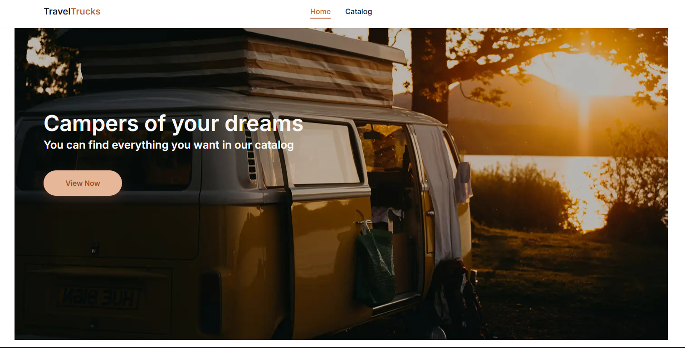
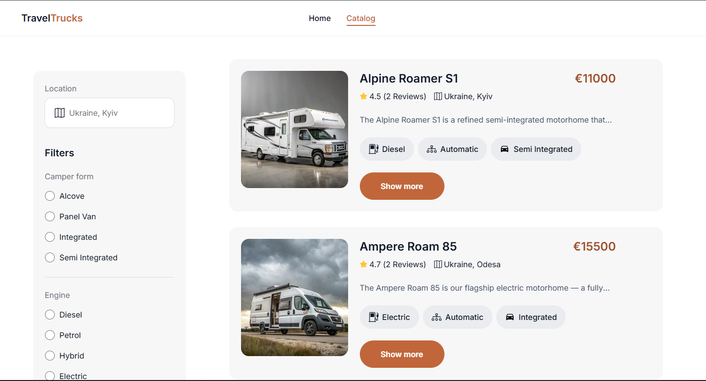
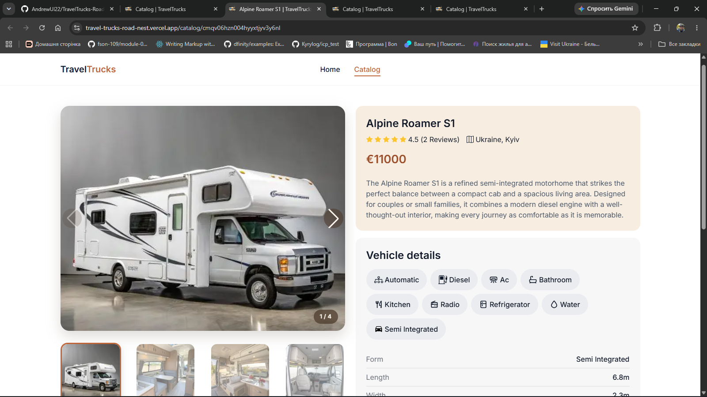

# **TravelTrucks RoadNest**

A modern web application for discovering, filtering, and comparing campers.  
Built with **Next.js App Router**, clean UI, advanced filtering, detailed vehicle pages, and smooth user experience.

---

## **Main Features**

### **🏠 Home Page (/)**  
- Hero banner with a primary call‑to‑action  
- Quick navigation to the catalog  
- Fully responsive layout for all devices  

---

### **📚 Camper Catalog (/catalog)**  
- Filtering by:
  - location  
  - body type  
  - engine  
  - transmission  
  - price  
- Fetching available filter options from API  
- Infinite loading of camper cards  
- **Load more** button for pagination  
- Loading states, overlay during refetch, error handling  
- **No results** state when filters return nothing  

---

### **🚐 Camper Card**  
- Image  
- Title  
- Price  
- Rating & review count  
- Location  
- Short description  
- Feature badges (engine, transmission, body type)  
- Link to detailed camper page  

---

### **🔍 Camper Details Page (/catalog/[camperId])**  
- Swiper gallery with main image + thumbnail navigation  
- Full vehicle description  
- Amenities and technical specifications  
- User reviews with rating  
- Booking form with validation  

---

## **Technical Solutions**

- API logic isolated in `src/services`:
  - base `apiFetch`  
  - query params handling  
  - `ApiError`  
  - separate modules for campers, reviews, filters, booking  
- Base API URL provided via `NEXT_PUBLIC_API_URL`  
- Catalog powered by **useInfiniteQuery**:
  - page control  
  - caching  
  - refetch  
  - incremental loading  
- Filters stored in catalog page state and included in `queryKey`  
- Camper details page split into independent components:
  - `CamperGallery`  
  - `VehicleDetails`  
  - `CamperReviews`  
  - `BookingForm`  
- Gallery implemented with Swiper  
- Booking form includes client‑side validation, ARIA attributes, and mutation request  
- UI states extracted into reusable components:
  - `Spinner`  
  - `LoadingOverlay`  
  - `NoResults`  
  - `LoadMoreButton`  
- Styling via CSS Modules for isolated component styles  

---

## **Project Structure**

src/
├── app/          # Next.js App Router pages & layouts
├── components/   # Reusable UI components
├── hooks/        # Custom React hooks
├── providers/    # Global providers (theme, context, etc.)
├── services/     # API services & data fetching logic
├── types/        # TypeScript types & interfaces
└── utils/        # Helper functions

---

## **Challenges & Result**

The main challenge was handling asynchronous data:  
the catalog must react to filters, support pagination, show intermediate loading states, and properly handle API errors.

The camper details page required combining gallery, specifications, reviews, and booking form — each with its own logic — while keeping the page cohesive and user‑friendly.

**Result:**  
A production‑ready application for browsing and booking campers with filtering, infinite catalog loading, detailed pages, reviews, booking flow, and Vercel deployment.

---

## **Tech Stack**

- **Next.js 13+ App Router**  
- **React 19**  
- **TypeScript**  
- **TanStack Query**  
- **CSS Modules / Tailwind**  
- **Swiper**  
- **React Icons**  
- **React Hot Toast**  

---

## **📸 Screenshots**

🌐 Deployment
Automatic Deployment
Every push to main triggers a Vercel build and deployment.

Manual Deployment

vercel --prod

📄 License
This project is licensed under the MIT License.

⭐ Support the Project
If you enjoy this project, consider giving it a star — it helps visibility and motivates further development.

